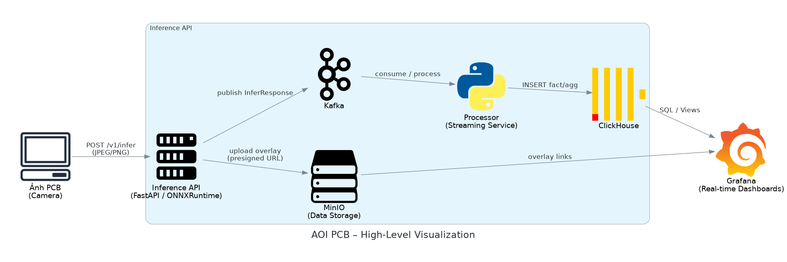

# Quality Control in PCB Manufacturing: Defect Detection in AOI

> Automated Optical Inspection (AOI) + Deep Learning–based Defect Detection + End-to-End Quality Control Pipeline

---

## Abstract

This repository contains an end-to-end system for **defect detection in Automated Optical Inspection (AOI)** for **Printed Circuit Boards (PCB)** in industrial environments.

The system combines:

- A **deep learning defect detector** (YOLOv8 exported to **ONNX – Open Neural Network Exchange**),
- A **production-ready inference API** that serves models and applies a fast **AQL-mini (Acceptable Quality Limit)** decision per board,
- A **streaming and analytics pipeline** built on **Apache Kafka**, **Confluent Schema Registry**, **ClickHouse**, and **MinIO**,
- And **dashboards / UIs** for real-time monitoring and historical quality analysis.

The architecture is designed for two deployment contexts:

1. **PCB fab (PCB manufacturing plant)** – AOI acts as a **final outgoing quality gate** before PCBs leave the factory.
2. **EMS / Assembly plant (Electronics Manufacturing Services)** – AOI is placed at **IQC PCB (Incoming Quality Control)** as a **quality gate for incoming PCBs** before SMT/reflow.

The goal is not only to detect visual defects, but also to turn AOI outputs into **actionable quality metrics** such as **First Pass Yield (FPY)** and **Defects Per Million Opportunities (DPMO)** that support both **Quality Control (QC)** and **Supply Chain Management (SCM)**.

---

## Project Overview

Modern electronics manufacturing requires:

- **100% inspection** of PCB boards,
- **Low-latency** inspection that does not block the line,
- And **traceable quality data** that can be aggregated by product, line, shift, supplier, and lot.

Many traditional AOI systems behave as **black boxes**: they produce PASS/FAIL at the machine level, but do not expose structured data that can be used by plant-level analytics or supply-chain decisions.

This project addresses three main questions:

1. How to build a **robust defect detection model** for AOI images of PCB?  
2. How to deploy that model in a **production-grade, low-latency pipeline**?  
3. How to connect AOI results to **AQL rules** and **quality metrics per vendor / lot / line**?

**Key contributions:**

- A **modular AOI pipeline** from camera to dashboards, suitable for academic study and industrial prototyping.
- A **YOLOv8-based defect detector** integrated via an ONNX runtime inside a FastAPI inference service.
- A **two-stage AQL decision logic**:
  - **AQL-mini**: fast per-board decision at inference time,
  - **Full AQL**: detailed evaluation in the streaming layer.
- A **data layer** (ClickHouse + MinIO) that supports FPY/DPMO computation and vendor/lot quality views for PCB fab and EMS plants.

---

## System Architecture

The system is organized into five main layers:

1. **Capture Layer**  
   Industrial camera at the AOI station captures PCB images.  
   A **MES (Manufacturing Execution System)** or a **Capture app** attaches **metadata** (product, serial, line, shift, supplier, lot) and sends `{image + metadata}` to the inference API.

2. **Inference Layer (apps.inference_api)**  
   A FastAPI-based **Inference API**:
   - Performs **pre-processing** (optional image registration, tiling),
   - Runs YOLOv8 in **ONNX** format to detect defects,
   - Applies **AQL-mini** to compute a quick PASS/FAIL per board,
   - Generates **overlay images** (raw + bounding boxes),
   - Stores images in **MinIO**,
   - Publishes **inspection events** to **Kafka** (with Avro schema via Schema Registry).

3. **Streaming Layer (apps.stream_processor)**  
   A **stream processor** subscribes to AOI results from Kafka and:
   - Loads **full AQL rules** per product / station / customer,
   - Computes the **final AQL decision** and severity (CRITICAL/MAJOR/MINOR),
   - Writes normalized inspection records into **ClickHouse**.

4. **Storage & Analytics Layer**  
   - **ClickHouse** stores structured inspection data (`aoi_inspections`, `yield_5m`, …), enabling fast FPY/DPMO aggregations.
   - **MinIO** stores **raw AOI images** and **overlay images**, referenced by URL in ClickHouse.

5. **Visualization Layer**  
   - **Grafana dashboards** for AOI overview, yield trends, supplier/lot quality, and system health.
   - Optional custom UI for **live inspections** and **inspection detail views** (raw + overlay + defect list).

### AOI Pipeline Visualization

The overall pipeline is summarized in the diagram below:





> Place `aoi_pipeline.png` at the repository root (or adjust the path above, e.g. `docs/aoi_pipeline.png`).

---

## Methods

### Defect Detection Model

* **Model family:** YOLOv8 (single-stage object detector).
* **Format:** exported to **ONNX** for framework-agnostic inference.
* **Inference runtime:** ONNX Runtime through a custom runner in `src/aoi/models/`.

**Input:**

* AOI image of a PCB (or tiles of the image).
* Optional pre-processing:

  * **Image registration**: align to a template to compensate for shifts,
  * **Tiling**: split large images into fixed-size patches for efficient inference.

**Output:**

* A list of defect detections:

  * `cls`: defect class label (e.g. short, open, missing pad),
  * `score`: confidence score,
  * `bbox`: bounding box `{x, y, w, h}` in image coordinates.

**Post-processing:**

* Non-Maximum Suppression (NMS) to merge overlapping detections,
* Mapping from tile coordinates to global image coordinates,
* Normalization into a common **defect schema** used across the pipeline.

### AQL-Based Quality Decision

We implement a **two-stage AQL logic**:

1. **AQL-mini (Inference API, per board, low latency)**
   A lightweight rule set applied immediately after detection:

   * `min_score`: minimum confidence threshold,
   * `max_defects`: maximum allowed number of defects,
   * `banned_classes`: defect types that always cause FAIL,
   * Optional **measurement thresholds** (e.g. clearance, trace width, pad offset) if such features are provided.

   This stage outputs a fast **`aql_mini_decision ∈ {PASS, FAIL}`**, suitable for real-time feedback to the line.

2. **Full AQL (Streaming Layer, aggregated and contextual)**
   In the stream processor:

   * Detailed **AQL specifications** are loaded per product / station / customer.
   * The system evaluates:

     * Defect counts by **severity level** (CRITICAL/MAJOR/MINOR),
     * Board-level PASS/FAIL with full reasoning,
     * Lot-level acceptance/rejection based on sample rules, if desired.

   The output is a **final decision** (`aql_final_decision`) and enriched metadata for analytics in ClickHouse.

---

## Installation & Setup

This section describes the **local setup** used in our experiments.
Adjust paths and credentials to your environment as needed.

### 1. Prerequisites

* **OS:** Linux (tested) or WSL2 on Windows
* **Python:** 3.9+
* **Services:**

  * Apache Kafka + ZooKeeper
  * Confluent Schema Registry
  * MinIO (or any S3-compatible storage)
  * ClickHouse
  * Grafana (for dashboards)

### 2. Start Kafka Stack

#### 2.1 Start ZooKeeper

```bash
export KAFKA_HOME=/opt/kafka/kafka_2.12-3.7.0

cd "$KAFKA_HOME"
bin/zookeeper-server-start.sh config/zookeeper.properties
```

#### 2.2 Start Kafka Broker

```bash
export KAFKA_HOME=/opt/kafka/kafka_2.12-3.7.0

cd "$KAFKA_HOME"
bin/kafka-server-start.sh config/server.properties
```

#### 2.3 Start Confluent Schema Registry

```bash
cd /opt/confluent/current
bin/schema-registry-start etc/schema-registry/schema-registry.properties
```

---

### 3. Start MinIO (Object Storage)

```bash
export MINIO_ROOT_USER=minioadmin
export MINIO_ROOT_PASSWORD=minioadmin

minio server /mnt/d/Defect-Detection/minio-data \
  --address ":9002" \
  --console-address ":9003"
```

* API endpoint: `http://localhost:9002`
* Web console: `http://localhost:9003`

---

### 4. Set Up Python Environment

From the project root:

```bash
python -m venv .venv
source .venv/bin/activate     # On Windows: .venv\Scripts\activate
pip install -r requirements.txt

# Ensure src/ is importable
export PYTHONPATH="$(pwd)/src"
```

---

### 5. Run the AOI Inference API

From the project root:

```bash
# Kafka & Schema Registry configuration
export KAFKA_BROKERS=localhost:9092
export SCHEMA_REGISTRY_URL=http://localhost:8081

# Clear any pre-set MINIO_ENDPOINT so config file is used
unset MINIO_ENDPOINT

# MinIO credentials (must match MinIO server)
export MINIO_ACCESS_KEY=minioadmin
export MINIO_SECRET_KEY=minioadmin

# Inference configuration and project root
export AOI_INFER_CONFIG=configs/inference.yaml
export AOI_PROJECT_ROOT="$(pwd)"

# Use real Kafka producer (unset mock mode)
unset AOI_PRODUCER_MODE

# Start FastAPI + Uvicorn
python -m uvicorn apps.inference_api.main:create_app \
  --factory --host 127.0.0.1 --port 8000 --reload
```

Health check:

```bash
curl -sS http://127.0.0.1:8000/healthz
```

---

### 6. Run the Stream Processor (Kafka → ClickHouse)

In a separate terminal, from the project root:

```bash
export AOI_STREAMING_CONFIG="$(pwd)/configs/streaming.yaml"

python -m apps.stream_processor.main
```

This process:

* Subscribes to AOI inference results from Kafka,
* Applies full AQL rules,
* Writes normalized results into ClickHouse.

---

### 7. Send a Sample Image Batch

To test the end-to-end pipeline with a folder of images:

```bash
python scripts/send_folder_to_api.py \
  --images ./images \
  --meta configs/demo_metadata.yaml \
  --api http://127.0.0.1:8000/v1/infer
```

---

### 8. Load JSONL into ClickHouse (Optional Backfill)

If you have a local JSONL file of inference results:

```bash
python scripts/load_jsonl_to_clickhouse.py \
  --stream-cfg configs/streaming.yaml \
  --jsonl data/processed/inference_results.jsonl \
  --user default \
  --password 280402
```

---

### 9. Basic ClickHouse Queries

Count all inspections:

```bash
clickhouse-client -h 127.0.0.1 \
  --user default --password 280402 \
  -d aoi \
  -q "SELECT count() FROM aoi_inspections"
```

Show recent inspections:

```bash
clickhouse-client -h 127.0.0.1 \
  --user default --password 280402 \
  -d aoi \
  -q "
    SELECT
      ts,
      event_id,
      product_code,
      station_id,
      aql_mini_decision,
      aql_final_decision,
      defect_count,
      image_overlay_url
    FROM aoi_inspections
    WHERE ts >= now() - INTERVAL 10 MINUTE
    ORDER BY ts DESC
    LIMIT 20
  "
```

5-minute FPY statistics (last 1 hour):

```bash
clickhouse-client -h 127.0.0.1 \
  --user default --password 280402 \
  -d aoi \
  -q "
    SELECT
      t_5m,
      product_code,
      station_id,
      pass_cnt,
      total_cnt,
      pass_cnt / NULLIF(total_cnt,0) AS fpy
    FROM yield_5m
    WHERE t_5m >= now() - INTERVAL 1 HOUR
    ORDER BY t_5m DESC
  "
```

---

### 10. Grafana (Dashboards)

Restart Grafana service and open the dashboards:

```bash
sudo systemctl restart grafana-server
sudo systemctl status grafana-server
```

Then open the Grafana UI (typically `http://localhost:3000`) and import the AOI dashboards from `grafana/dashboards/`.

---

```
```
